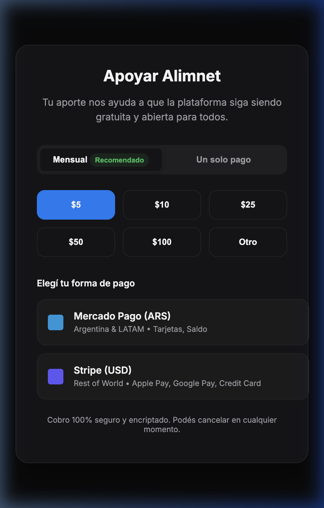

# Spec Alimnet: Global & Local Donations Hub

## 1. Context & Purpose
Alimnet is a free platform. To ensure long-term sustainability, we are introducing a "Support/Donations" system. 
The goal is to provide a seamless, high-quality experience (white-label) where users can easily support the platform through one-time or recurring (subscription) payments using both local (ARS/Mercado Pago) and global (USD/Stripe) rails.

## 2. Requirements & Goals
- **Dual-Path Strategy:** ARS for Argentina/LATAM via Mercado Pago, USD for the rest of the world via Stripe.
- **Payment Types:** Support for one-time donations AND monthly recurring subscriptions.
- **User Experience:** Fully integrated look (white-label), with support for Apple Pay, Google Pay, and common local methods.
| Nivel | Nombre Estratégico | Monto Mensual | Monto Único | Racional Financiero |
| :--- | :--- | :--- | :--- | :--- |
| **1** | **Semilla** | **$5.000 ARS** / **$5 USD** | **$12.000 ARS** / **$12 USD** | Cobertura de costos base. |
| **2** | **Aliado / Brote** | **$17.000 ARS** / **$12 USD** | **$40.000 ARS** / **$40 USD** | **Target.** Sostenibilidad operativa. |
| **3** | **Sustento** | **$25.000 ARS** / **$30 USD** | **$60.000 ARS** / **$100 USD** | Crecimiento de la red. |
| **4** | **Impulsor** | **$50.000 ARS** / **$75 USD** | **$120.000 ARS** / **$250 USD** | Auditoría y expansión. |
| **5** | **Libre** | **Min $5.000 ARS / $5 USD** | **Min $5.000 ARS / $5 USD** | Capacidad personalizada. |
- **Subscription Management:** Users must be able to cancel or adjust their payments from their profile.
- **Security:** Zero card data should touch Alimnet's servers (using Stripe Elements and MP Bricks).

## 3. Architecture & Tech Stack

### Frontend (Next.js + Framer Motion)
- **Donation Hub Component:** A modern, interactive UI (modal or page) to select plan/amount/method.
- **Stripe Elements:** The "Payment Element" automatically handles Apple Pay, Google Pay, and link-based payments.
- **Mercado Pago Bricks:** Embedded SDK for ARS payments (Card Brick + Wallet Brick).

### Backend (Supabase + Next.js API Routes/Edge Functions)
- **Payment Intents:** APIs to create Stripe "PaymentIntents" and Mercado Pago "Preferences" on the server.
- **Webhooks:** Crucial handlers to listen for:
  - `checkout.session.completed` (Stripe)
  - `payment.created`, `subscription.created` (Mercado Pago)
  - `invoice.paid`, `invoice.payment_failed` (Stripe recurring payments)

### Database Schema (Supabase)
New tables to track donation status:
- `user_donations`: Tracks one-time amounts and method used. 
- `user_subscriptions`: Stores gateway-specific IDs (Stripe Customer ID, MP PreApproval ID) and status (`active`, `past_due`, `cancelled`).

## 4. Proposed UI/UX
The "Donation Hub" will be centrally located and visually consistent with Alimnet's dark, premium aesthetic.

### Key Features:
- **Frequency Toggle:** Monthly (Recommended) vs. One-time.
- **Quick Amounts ($5, $10, $25, ...):** Proven to increase conversion.
- **Dynamic Payment Options:** The Stripe button will show Apple Pay logo on iOS or Google Pay on Android automatically.

## 5. Implementation Roadmap
1. **Infrastructure:** Set up Stripe and Mercado Pago developer accounts.
2. **Library Installation:** Add `stripe-js`, `@stripe/stripe-js`, and `mercadopago` SDKs.
3. **Database Setup:** Run migrations for `user_subscriptions` and `user_donations`.
4. **API Layer:** Create secure endpoints for secret generation and webhooks.
5. **Frontend Core:** Implement the `DonationHub` component with Framer Motion animations.
6. **Payment Integration:** Wire up the Bricks and Elements libraries.
7. **Testing:** Full end-to-end testing in Sandbox modes for ARS and USD.

## 6. Success Metrics
- Conversion rate from "Visit /donar" to "Successful payment".
- Low friction (measured by time to complete payment).
- Accurate webhook handling and DB synchronization.

## 7. Future Considerations
- **Wallbit Bridge:** Use the Stripe -> Wise -> Wallbit path to withdraw funds into Argentina as stablecoins or pesos with minimal fees.
- **Reward Tiers:** Add small badges or visual flairs for users who reach "Top Contributor" levels.
